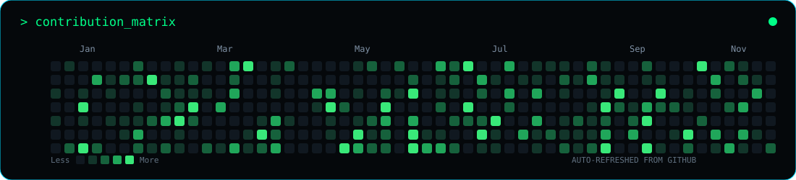
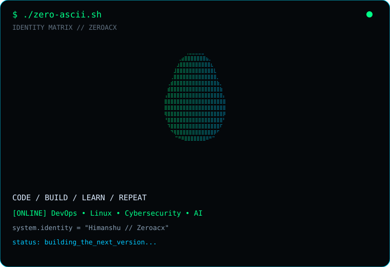
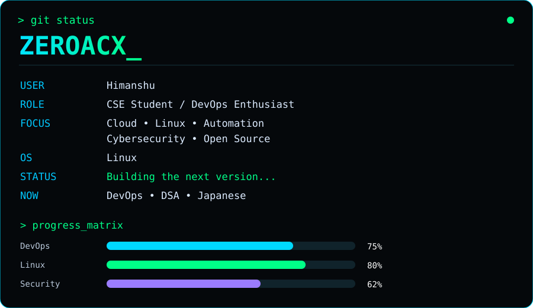

<div align="center">

<h3><code>zero@github ~ $ neofetch</code></h3>



<br><br>

<table>
<tr>
<td valign="top" width="43%">



</td>

<td valign="top" width="57%">



</td>
</tr>
</table>

</div>

<br>

<div align="center">

<h3><code>zero@github ~ $ cat about.txt</code></h3>

</div>

```text
> CSE student who enjoys building, automating and experimenting.
> Interested in DevOps, Linux, Cybersecurity, AI and Open Source.
> Currently exploring cloud infrastructure, automation and software development.
> Learning continuously and building projects along the way.
>
> Focus:
> ├── DevOps
> ├── Linux
> ├── Cybersecurity
> ├── AI / Automation
> └── Open Source
>
> Motto: Code. Build. Learn. Repeat.
```

<br>

<div align="center">

<h3><code>zero@github ~ $ tech_stack.sh</code></h3>

<br>


</div>

<br>

<div align="center">

<h3><code>zero@github ~ $ ls -la projects/</code></h3>

</div>

<table>
<tr>

<td width="50%" valign="top">

### `01` — DevOps

**Infrastructure • Automation • Linux**

Building tools, scripts and experiments around DevOps, Linux and cloud technologies.

</td>

<td width="50%" valign="top">

### `02` — Cybersecurity

**Security • Linux • Ethical Hacking**

Exploring defensive security, vulnerability research and ethical security tooling.

</td>

</tr>

<tr>

<td width="50%" valign="top">

### `03` — AI / ML

**Artificial Intelligence • Automation**

Experimenting with AI-powered applications, automation and intelligent systems.

</td>

<td width="50%" valign="top">

### `04` — Web

**HTML • CSS • JavaScript**

Building interfaces, dashboards and experimental web projects.

</td>

</tr>
</table>

<br>

<div align="center">

<h3><code>zero@github ~ $ currently_learning</code></h3>

<br>

```text
[████████████████░░░░] DevOps
[██████████████░░░░░░] Linux
[████████████░░░░░░░░] Cybersecurity
[███████████░░░░░░░░░] DSA
[█████████░░░░░░░░░░░] Japanese
```

</div>

<br>

<div align="center">

<h3><code>zero@github ~ $ ./connect.sh</code></h3>

<br>

<a href="https://github.com/Zeroacx">

</a>

<a href="https://www.linkedin.com/">

</a>

<br><br>

<code>Code • Build • Learn • Repeat</code>

</div>

<br>

<div align="center">

<sub>⚡ Building things that make me better at building things.</sub>

</div>
